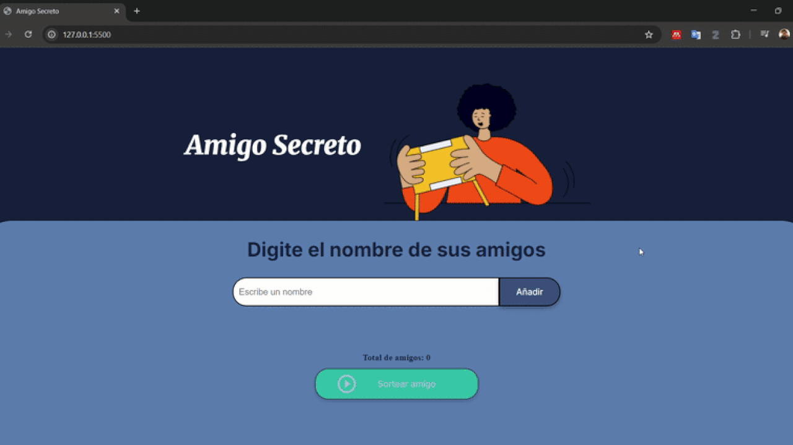

# 🎁 AMIGO SECRETO

**Estado del proyecto:** ✅ Terminado y funcional

## 📑 Índice
- [Descripción](#descripción)
- [Características](#características)
- [Demostración](#demostración)
- [Tecnologías](#tecnologías)
- [Autor](#autor)

## 📝 Descripción
**Amigo Secreto** es una aplicación web interactiva que sirve para organizar sorteos de regalos entre varios amigos. Se emplea una interfaz intuitiva, responsive y amigable para el usuario, la cual permite añadir participantes, eliminar participantes ya ingresados, realizar el sorteo y mostrar el resultado de forma dinámica.

## ⚙️ Características
- Interfaz de usuario amigable y responsive
- Añadir y eliminar participantes
- Validación de nombres duplicados
- Contador en tiempo real de participantes
- Sorteo aleatorio entre los participantes
- Diseño adaptable a diferentes dispositivos

## 🎮 Demostración

Para probar la aplicación, simplemente:
1. Añade nombres de participantes
2. Cuando tengas al menos dos participantes, haz clic en "Sortear amigo"
3. Al cumplir mínimo dos participantes el botón "Sortear amigo" cambia de color
4. Agrega nombres válidos (no espacios en blanco)
5. Inserta nombres que no se encuentren repetidos
6. Elimina nombres que hayas ingresado por error en la X roja de la derecha del nombre a borrar
7. Visibiliza el número total de amigos ingresados en la parte inferior
8. Presiona el botón "Sortear amigo" ¡Descubre quién es el amigo secreto seleccionado!
9. ¡Sigue usando la aplicación ingresando nuevos amigos para realizar otro sorteo!

## 🛠️ Tecnologías
Este proyecto fue desarrollado con:
- **HTML5** - Estructura semántica
- **CSS3** - Estilos con variables CSS y media queries
- **JavaScript** - Manipulación del DOM y lógica de la aplicación
- **Google Fonts** - Fuentes Inter y Merriweather

## 👨‍💻 Autor
[Francisco Xavier Rosero Jaramillo]([https://github.com/tu-usuario](https://github.com/francisco-roserojaramillo))

---

⭐ *El presente proyecto fue desarrollado como desafío para mejorar habilidades en lógica de programación para el programa Oracle Next Generation ONE en el grupo G8 en conjunto entre las empresas Oracle y Alura Latam.*
